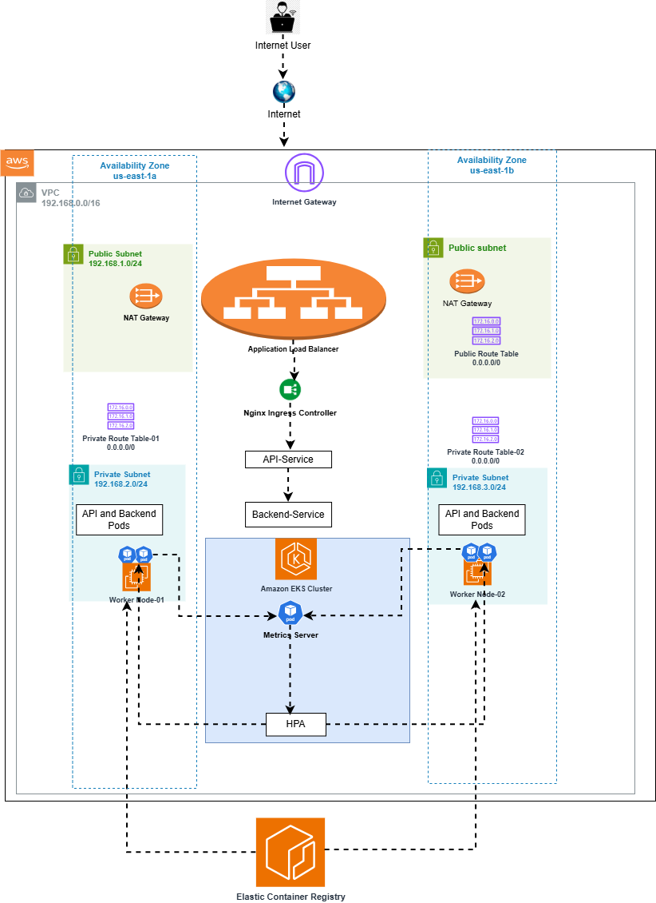

## Production-Grade Microservices Platform on Amazon EKS


## Overview

This project demonstrates a production-style microservices deployment on Amazon EKS, focusing on Kubernetes networking, autoscaling, and service communication.

The goal was to build a realistic Kubernetes environment — not just deploy containers — but understand how infrastructure, routing, and scaling work 
together in practice.


## Architecture Diagram

The diagram below illustrates the overall system design, including traffic flow, service communication, autoscaling, and container image sourcing.





## Architecture

- Amazon EKS cluster

- Managed node group

- Docker images stored in Amazon ECR

- Two microservices:

   - Backend Service

   - API Service

- ClusterIP Services for internal communication

- NGINX Ingress Controller for traffic routing

- Metrics-server for resource metrics

- Horizontal Pod Autoscaler (HPA) for CPU-based scaling


## Technology Stack

- Kubernetes (Amazon EKS)

- Docker

- Amazon ECR

- ExternalDNS (Automated DNS management)

- NGINX Ingress Controller

- Horizontal Pod Autoscaler (HPA)

- Metrics-server


## Application Design

## Backend Service

1. Deployed as a Kubernetes Deployment

2. Exposed internally via ClusterIP

3. Designed for internal microservice communication


## API Service

1. Deployed as a Kubernetes Deployment

2. Exposed internally via ClusterIP

3. Provides /health endpoint

4. Configured with CPU requests and limits

5. Connected to HPA for autoscaling


## Autoscaling Implementation

The API service was configured with:

- Defined CPU requests and limits

- Horizontal Pod Autoscaler (HPA)

- Metrics-server integration

- Load testing was performed to validate that:

- CPU utilization exceeded the configured threshold

- Replica count increased dynamically

- Kubernetes control loop responded correctly

- This confirmed autoscaling was functioning as expected.


## Ingress Configuration

The NGINX Ingress Controller was deployed to:

1. Route external traffic to internal services

2. Provide centralized entry into the cluster

3. Avoid dependency on AWS ALB

4. Ingress rules were validated to ensure correct service routing.


## External DNS Integration

This project also included ExternalDNS to automate DNS record management directly from Kubernetes.

ExternalDNS was configured to:


- Monitor Kubernetes Ingress resources

- Automatically create and update DNS records

- Map the application domain to the Ingress LoadBalancer

This eliminated manual DNS updates and ensured that domain routing remained synchronized with cluster state.


Using ExternalDNS reinforces a production-ready approach by:


- Reducing manual DNS configuration

- Preventing routing drift

- Enabling infrastructure-driven DNS management


##  Project Structure

```
k8s/
├── 01-namespace/
├── 02-ingress/
├── 03-metrics/
├── 04-apps/
│   ├── backend-deployment.yaml
│   ├── backend-service.yaml
│   ├── api-deployment.yaml
│   ├── api-service.yaml
│   └── api-hpa.yaml
```


Docker images are built locally and pushed to Amazon ECR before deployment.


## Key Learning Outcomes

- Kubernetes autoscaling requires defined CPU requests

- Labels and selectors must align exactly for services to function

- Ingress routing depends on correct service port configuration

- HPA depends on metrics-server availability

- Real-world troubleshooting builds production confidence

- Cost awareness is part of responsible cloud engineering


## Validation Checklist

- Cluster nodes in Ready state

- All pods running

- Services accessible internally

- Ingress routing verified

- HPA scaling tested under load


## Future Enhancements

- Observability stack (Prometheus + Grafana)

- CI/CD integration

- Infrastructure provisioning via Terraform


## Author

Onyedika Okoro

Cloud & DevOps Engineer

Focused on building production-ready cloud-native systems.